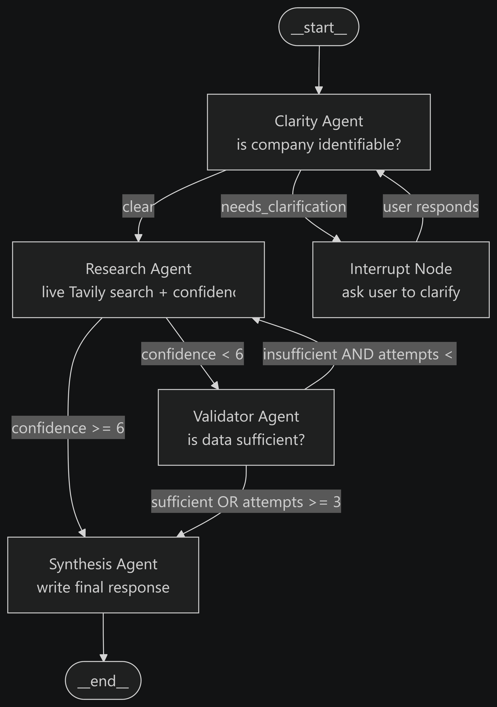

# Research Assistant — LangGraph Multi-Agent System

A 4-agent research assistant built with [LangGraph](https://github.com/langchain-ai/langgraph)
that helps users gather information about companies. The system routes queries through
specialised agents, performs live web searches via Tavily, supports multi-turn
conversation, and requests human clarification when queries are ambiguous.

---

## Architecture



```
START
  |
  v
+------------------+
|  Clarity Agent   |----(needs_clarification)----> [HITL Interrupt]
+------------------+                                      |
        | clear                                    user provides company
        v                                                  |
+------------------+  <-----------------------------------+
| Research Agent   |----(confidence < 6)----> Validator Agent
+------------------+                               |
        | confidence >= 6             insufficient + attempts < 3
        |                                          |
        |           +------------------------------+
        |           | sufficient OR max attempts (3)
        v           v
+------------------+
| Synthesis Agent  |----> END
+------------------+
```

### Agents

| Agent | Role | Key Output |
|---|---|---|
| **Clarity Agent** | Checks if query names a specific company; interrupts if vague | `clarity_status`: clear / needs_clarification |
| **Research Agent** | Live Tavily web search; LLM scores result quality | `confidence_score` 0–10, `research_findings` |
| **Validator Agent** | Reviews whether findings adequately answer the query | `validation_result`: sufficient / insufficient |
| **Synthesis Agent** | Writes final user-facing response from all findings | `final_response` string |

### Routing Logic

| From | Condition | To |
|---|---|---|
| Clarity | `needs_clarification` | HITL interrupt → back to Clarity |
| Clarity | `clear` | Research |
| Research | `confidence_score < 6` | Validator |
| Research | `confidence_score >= 6` | Synthesis |
| Validator | `insufficient` AND `attempts < 3` | Research (retry) |
| Validator | `sufficient` OR `attempts >= 3` | Synthesis |

---

## Prerequisites

- Python 3.12
- `GOOGLE_API_KEY` — [Google AI Studio](https://aistudio.google.com/app/apikey)
- `TAVILY_API_KEY` — [tavily.com](https://tavily.com) (free tier available)
- `LANGCHAIN_API_KEY` — [smith.langchain.com](https://smith.langchain.com) (optional, free)

---

## Setup

```bash
# 1. Activate virtual environment
.venv\Scripts\activate          # Windows
# source .venv/bin/activate     # macOS/Linux

# 2. Install dependencies
pip install -r requirements.txt

# 3. Configure environment
copy .env.example .env
# Edit .env and fill in your API keys
```

---

## Running

### Interactive mode
```bash
python main.py
```
Ask about any company. Follow-up questions work — context is preserved across turns.

### Demo mode
```bash
python main.py --demo
```
Runs 3 scripted turns demonstrating:
1. Clear query → full Research → Synthesis pipeline
2. Follow-up on same thread (multi-turn memory)
3. Vague query → HITL interrupt → clarification → Research → Synthesis

### Custom database path
```bash
python main.py --db /path/to/custom.db
```

---

## Observability — LangSmith

LangGraph auto-instruments itself with LangSmith when these env vars are set:

```
LANGCHAIN_TRACING_V2=true
LANGCHAIN_API_KEY=<your key>
LANGCHAIN_PROJECT=research-assistant
```

**Zero code changes required.** Every run at [smith.langchain.com](https://smith.langchain.com)
shows a full nested trace:

```
Trace: "Tell me about Apple Inc"     [4.2s | 4,824 tokens]
 |- clarity   [0.8s |   330 tokens]  INPUT: messages  OUTPUT: clarity_status=clear
 |- research  [2.1s | 1,906 tokens]  INPUT: query     OUTPUT: confidence=7.5, 5 hits
 |   |- search_company (Tavily)      TOOL CALL: "Apple Inc news financials"
 |   |- gemini-2.5-flash             TOKENS: prompt=1842 completion=64
 |- synthesis [1.3s | 2,588 tokens]  INPUT: findings  OUTPUT: final_response
```

The CLI also prints a one-line status showing whether LangSmith is active.

---

## Conversation Persistence

Conversation history is stored in `research_assistant.db` (SQLite) using
LangGraph's `SqliteSaver` checkpointer. State persists across process restarts.

- Interactive mode uses `thread_id = "session-1"` by default
- Delete `research_assistant.db` to start a fresh conversation

---

## Project Structure

```
.
├── main.py                              # CLI entry point
├── requirements.txt
├── .env.example
├── README.md
└── research_assistant/
    ├── state.py                         # ResearchState TypedDict (8 fields)
    ├── graph.py                         # Graph assembly + SqliteSaver compile
    ├── agents/
    │   ├── clarity_agent.py             # ClarityAgent + route_after_clarity
    │   ├── research_agent.py            # ResearchAgent + route_after_research
    │   ├── validator_agent.py           # ValidatorAgent + route_after_validation
    │   └── synthesis_agent.py           # SynthesisAgent
    └── tools/
        └── search.py                    # Tavily search wrapper
```

---

## Assumptions

1. `TAVILY_API_KEY` is required — the system raises a clear error on startup if absent
2. SQLite persists to `research_assistant.db` — delete to reset all conversation history
3. Gemini model: `gemini-2.5-flash`
4. Multi-turn follow-ups work because the full `messages` list is passed to each agent
5. After clarification, the query re-enters the Clarity Agent to be re-evaluated
6. Max research attempts is capped at 3 — Synthesis notes partial info if cap is reached
7. Confidence scoring is evaluated by the LLM based on actual Tavily result quality

---

## Beyond Expected Deliverable

### LangSmith Observability 
Every agent node, LLM call, tool call, token count, and HITL event is traced.
The CLI prints a status line confirming whether tracing is active.
Here is the trace for reference: https://smith.langchain.com/public/82360ccd-c251-410c-9177-3e779d4aac9c/r/019f1918-d104-7563-b6c2-9c4f022d6e84

### Live Tavily Web Search
Real-time web searches via the Tavily API — up-to-date information on any company,
not hardcoded mock data.

### SQLite-Backed Conversation Persistence
`SqliteSaver` persists conversation state across process restarts. Users can resume
sessions exactly where they left off.

### Pydantic Structured Outputs
All agents use `llm.with_structured_output(PydanticModel)` for deterministic,
typed responses — no fragile string parsing.

### Optimised HITL Resume Path
The Clarity Agent guards against a redundant LLM call on interrupt resume:
`state["clarity_status"] == "needs_clarification"` is checked first so `interrupt()`
is reached immediately without re-invoking the LLM.

### Colourised Agent Trace in Terminal
Each agent fires in a distinct colour with its decision printed inline
(confidence score, validation result, etc.) — the full pipeline is visible
at a glance without needing an external UI.

### Interative Mode and Demo Mode (`--demo`)
Runs the program in two modes based on user preference, interactive mode or demo mode.
In demo mode: Three scripted turns run automatically, demonstrating every routing path
including the HITL interrupt with auto-supplied clarification.
